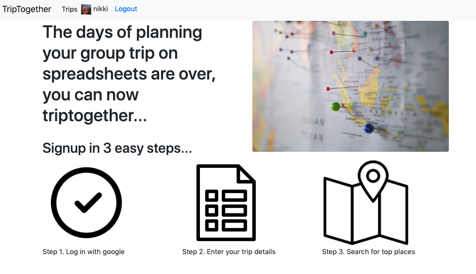
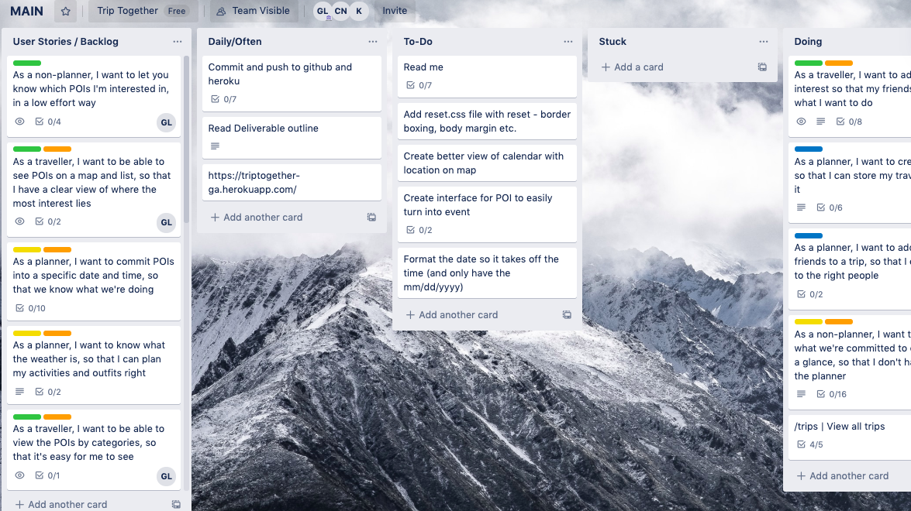
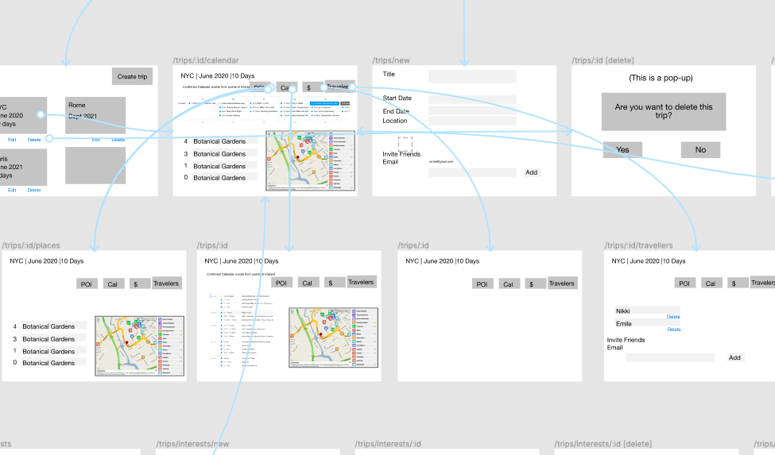

# TripTogether

Demo here: [TripTogether](http://triptogether-ga.herokuapp.com/)

Created by [Chai Ng](https://github.com/chai-ng), [Emile Desfontaines](https://github.com/Katzen85), and [Nikki Ricks](https://github.com/nikkiricks)

Trip Together is a collaborative, and democratic travel app helping you to plan trips around your location and schedule.

Currently in the market there's no platform where you can plan a small group trip and have a shared itinerary. TripTogether allows you conveniently log in with your google account, create a new trip, invite your friends, search for places of interest, and vote as a group on where you would like to go. You can then add those events to your google calendar for convenient access while you're on the go. 

## Technology used

  * Ruby 2.6.5
  * JavaScript
  * CSS, [Bootstrap](https://getbootstrap.com/)
  * AJAX, jQuery
  * OAuth, Redis, OmniAuth
  * Google API Client for Ruby

## User story

Some features that the user will want in planning their trip are:

* Having multiple trips
* Inviting different friends to different trips
* Searching on google and displaying in a map, points of interest with information like reviews, opening times, costs, location
* Voting on the places of interest as a group and see what we prioritise for the trip
* Adding the top places of interest and then creating an event on a group calendar where we can all have access to it before and during our event.

## Planning Process

### Group brainstorm

As a group we brainstormed who the target user was. What their pain points were, and how we could solve them with our product. We brainstormed potential features that the user would want with sticky notes and then categorized them.

### Quick paper sketches

We then when drew potential wireframes of the product and feature placements.

### User stories in Trello

With the user in mind, we created user story cards that acted as our action items in Trello.

### Wireframes in Figma

And we used Figma to prototype and create a user flow through the app.

### Database relationships

We had 5 tables:

* Users
* Trips
  * referenced user_id
* Places
  * referenced user_id and trip_id
* Travellers
  * referenced user_email and trip_id
* Votes
  * reference user_id trip_id and place_id

## Challenges

Some of the challenges we faced were:

* This was our first group project, so learning how to use Git and Github properly and understanding version control. It was new for all of use using fetch, rebase, and branching.

* Google API's are a bit of a learning curve and don't offer a lot of information to set up as a beginner.

## Lessons learned

* RESTful routes can save you a lot of time and grief 

* How and when to use different languages. It was important to us to not have a page refresh with every request, so setting up our own API so we could use JavaScript with AJAX and jQuery was necessary. 

* Researching and using Google API's:
  * OAuth
  * Places
  * Calendar

* Whole lot of practice

* Need to learn when to use APIs vs. not (e.g. creating a new trip where user is redirected and you need a page refresh), APIs with re-directs will break

## Unsolved problems and bonus features

* Budget feature. We wanted users to see how much they were spending on the trip in total and per day so they could adjust their planned activities. We also wanted to allow users to insert anything that they had paid for before and during the trip and briefly researched using the SplitWise API to handle doing the calculations but we ran out of time.

* We ran into google adding a paywall to place's data categories like: photos, website, phone number, open hours that would be important as a user to have. 

* Email notification. The ability to send an email to the different travellers in your group notifying them to join the trip.

